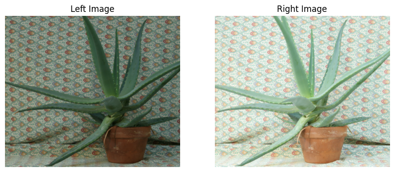
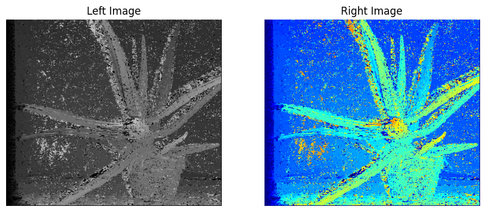
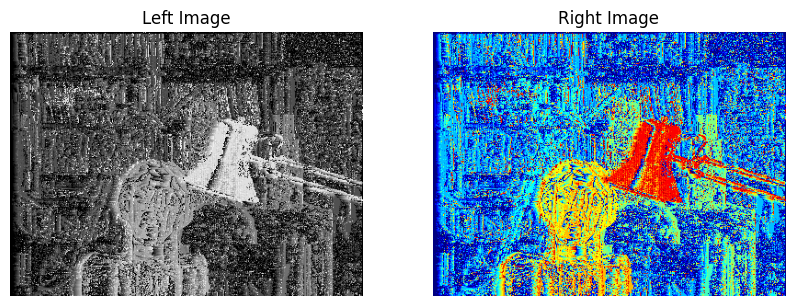

# depth-image-estimation

This repository contains exercises on stereo matching techniques. The goal is to estimate the disparity map from a pair of stereo images using various matching techniques.






## Folder Structure

The repository is organized as follows:

```
├── 01_pixel_wise_matching.ipynb
├── 02_window_based_matching.ipynb
├── 03_window_based_matching_brighter.ipynb
├── 04_window_based_matching_cosine.ipynb
├── README.md
├── data
│   ├── aloe
│   │   ├── Aloe_left_1.png
│   │   ├── Aloe_right_1.png
│   │   ├── Aloe_right_2.png
│   │   ├── Aloe_right_3.png
│   │   └── Disparity_map_corr.png
│   └── tsukuba
│       ├── groundtruth.png
│       ├── left.png
│       └── right.png
├── outputs
│   ├── pixel_wise_l1.png
│   ├── pixel_wise_l1_color.png
│   ├── pixel_wise_l2.png
│   ├── pixel_wise_l2_color.png
│   ├── window_based_cosine_similarity.png
│   ├── window_based_cosine_similarity_color.png
│   ├── window_based_l1.png
│   ├── window_based_l1_color.png
│   ├── window_based_l2.png
│   └── window_based_l2_color.png
└── requirements.txt
```

## Notebooks

1. **01_pixel_wise_matching.ipynb**: This notebook covers pixel-wise matching techniques using L1 and L2 norms.
2. **02_window_based_matching.ipynb**: This explores window-based matching with different window sizes and aggregation techniques.
3. **03_window_based_matching_brighter.ipynb**: This focuses on window-based matching for images with varying brightness.
4. **04_window_based_matching_cosine.ipynb**: This investigates window-based matching using cosine similarity as the metric.

## Data

The `data` folder contains two stereo datasets:

- **aloe**: 
  - `Aloe_left_1.png`, `Aloe_right_1.png`, `Aloe_right_2.png`, `Aloe_right_3.png`: Stereo image pairs.
  - `Disparity_map_corr.png`: The corresponding ground truth disparity map.
  
- **tsukuba**: 
  - `left.png`, `right.png`: Stereo image pair.
  - `groundtruth.png`: The corresponding ground truth disparity map.

## Outputs

The `outputs` folder contains the resulting disparity maps generated by different techniques:

- `pixel_wise_l1.png`
- `pixel_wise_l1_color.png`
- `pixel_wise_l2.png`
- `pixel_wise_l2_color.png`
- `window_based_cosine_similarity.png`
- `window_based_cosine_similarity_color.png`
- `window_based_l1.png`
- `window_based_l1_color.png`
- `window_based_l2.png`
- `window_based_l2_color.png`

## Requirements

The `requirements.txt` file contains the necessary Python packages to run the notebooks. You can install them using:

```bash
pip install -r requirements.txt
```